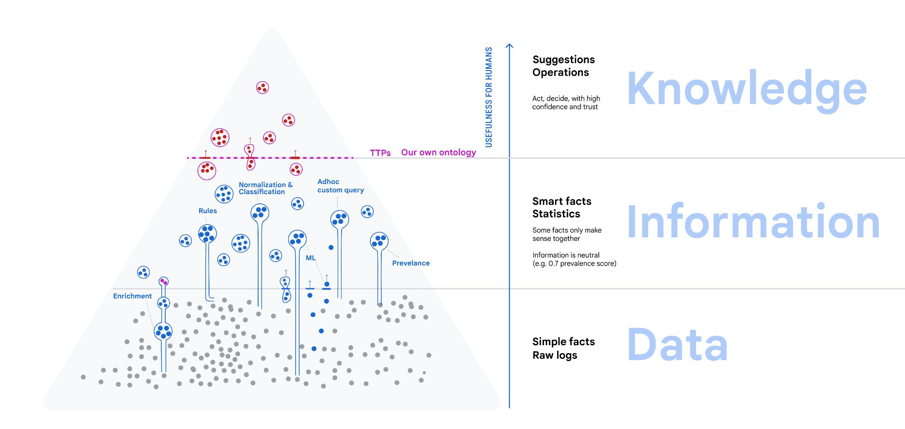
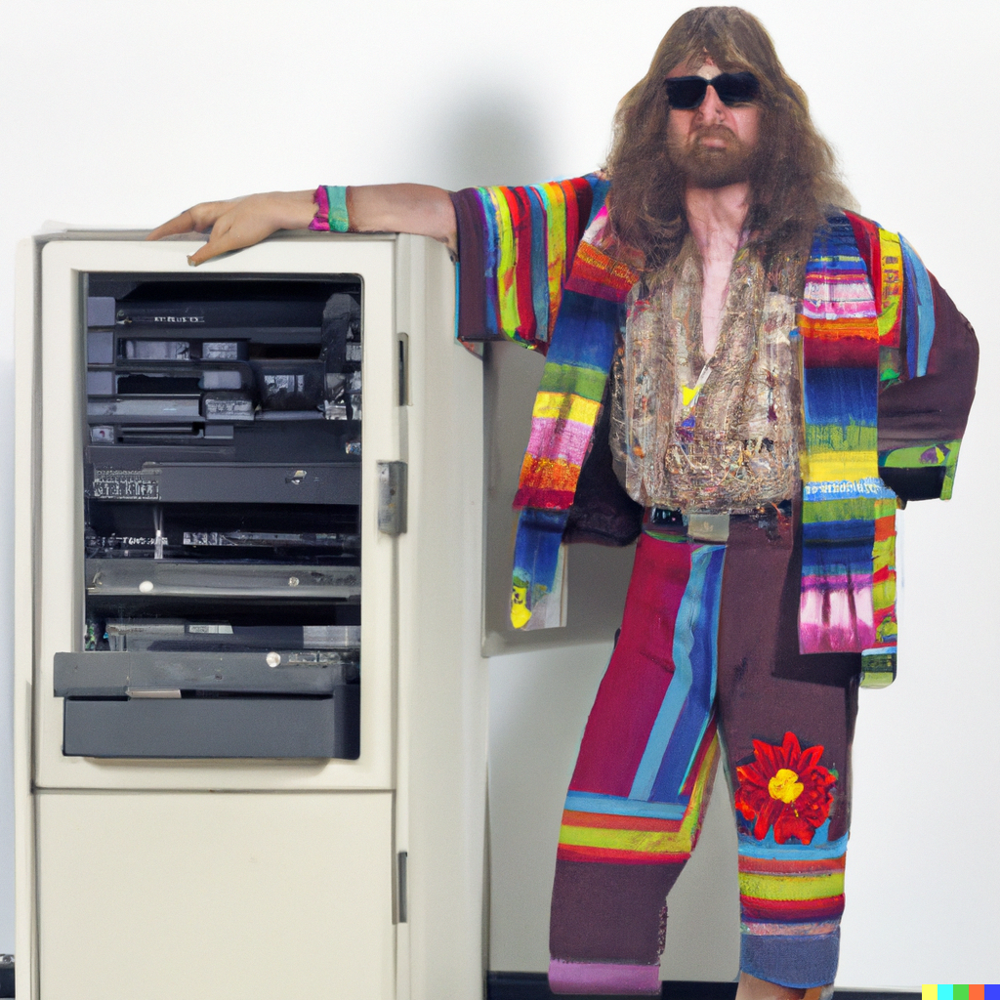

# Data Information Knowledge

Mangle started out within a web app to access metadata of some artifacts.

I wanted to keep door open to large-scale data processing, and separate language from application.

The problem space, very broadly:
 * analyze *data* and turn it into *knowledge* (analytics)
 * make knowledge explicit, (ontology, logic/rules)
 * ... in order to help communication and collaboration 
 * ... in a way that does not force us into a schema
   * we knew that our ideas of entities, queries and UI would have to evolve.

<!--web-only-->

The [data-information-knowledge hierarchy](https://en.wikipedia.org/wiki/DIKW_pyramid) distinguishes
- *data*: what comes in all shapes and forms, not yet organized.
- *information* is derived from data by organizing, classified, normalized
- *knowledge* is what can serve as specific answer that humans need when making decisions, judging a situation or taking actions in the pursuit of some outcomes.

All these involve querying.
<!--web-only-end-->

<!--
# An example domain: Cybersecurity

We focus on examples from cybersecurity, but the methods can be applied to many other domains such as business analytics.

-->

## Databases, pipelines, query processing

- SQL is likely the most prevalent language for querying data.
- But I remember a brief time where SQL was less relevant
  - "NoSQL", sharding, bigtable, MapReduce, JavaFlume (Craig Chambers).
  - through engineering, can store and query with high performance on many cheap servers
  
As a programming language, SQL is hopelessly anachronistic (1970s style).
- Not readable, not testable
- No *proper abstraction mechanism* (modules), copy-paste-reuse
- No standard extensibility (connecting to external systems), schema evolution issues
- No (easy, standard) way to deal with recursion / transitive closure

## But why did SQL come back?

I have asked an AI to generate a picture of a SQL hacker in 1970s:

  - not only due to "familiarity" ...
    - evolution ZetaSQL, BigQuery SQL with protos...
    - relational algebra, first-order logic is a good foundation - "declarative"
    - theory continues to be taught at university (even completely irrelevant stuff like normal forms) - there is material that *can* be taught

  - business reasons related to people/skills
    - not everybody is an engineer,
    - even for engineers, one may want to scale up to 1000s of queries or processing pipelines.
    - not just familiar, but also familiar and *high-level* / declarative: can adapt to embarassingly parallel execution

Why is datalog even better as a foundation:
* can address shortcomings above
* if nothing else: implicit joins 
