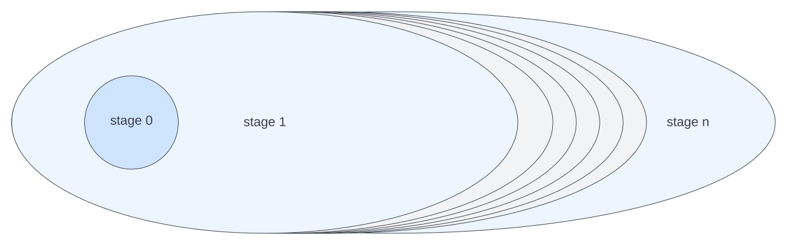

# Where is the AI?

We are getting there.

## Stratified evaluation

Our Mangle programs are evaluated in layers (strata).

Each layer treates all predicates from the preceding one as extensional (fully computed, accessible).

This means, every layer adds new facts. Picture:

## How does this help with my LLM use case?

The possibility of defining interesting relations in terms of other relations yields opportunities to apply ML:
- first, product the "right" numbers to statistical modeling, regression etc
- graph techniques, where we construct interesting graph elements (nodes, edges, subgraphs) through rules. 
  - graph ML as in link prediction, or prediction of attributes of nodes, edges, whole graph.

But you asked about LLMs.

- LLMs are interesting because they promise low-barrier access to AI without feature engineering and researcher etc.
- (things that have to be said) 
  - LLMs are "stochastic parrots" 
  - Any ML task cannot succeed without data and being able to evaluate *quality* of the task
  - think about the integration in apps which is hard engineering work
  - as all tech, think about the power structures, biases and your responsibility

## Embedding and retrieval

It is expected that only large tech companies and nation states can produce LLMs.

The economic appeal is that *fine-tuning* and *prompt engineering* are avaiable to all.

A promising direction to use relational data is to:
 - from a prompts/NLP query, extract entities
 - retrieve *related* entities
   - (similarity, embeddings, vector search)
   - and/or predicates
   - or ask the LLM what is related. 
 - send the enriched prompt to the LLM

 The resulting interaction could look like this (where have I seen this before):

